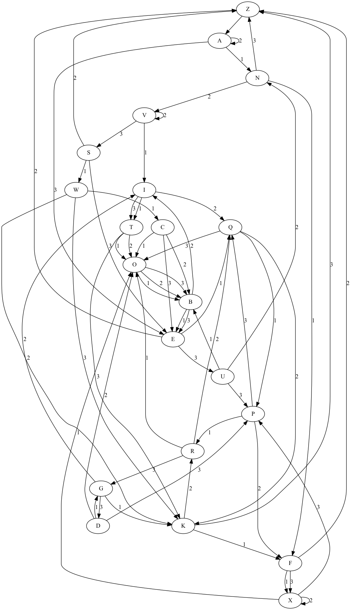

- [Installing Dependencies](#installing-dependencies)
	- [Installing Graphviz](#installing-graphviz)
	- [Installing Python Dependencies](#installing-python-dependencies)
- [Running the Program](#running-the-program)


# Installing Dependencies

## Installing Graphviz

This program utilises [`Graphviz`](https://www.graphviz.org/) and hence the user who wants to use this program must have `Graphviz` installed on their computer. On macOS, this is very simple as a user can simply install the tool using this command below:

```
brew install graphviz
```

Please make sure that you have this tool installed on your machine before moving on to the next step

## Installing Python Dependencies
Please run this command from the root directory of the project:

```
pip install -r requirements.txt
```

# Running the Program

Simply go to the root directory of the project and run:

```
python main.py
```

The program will then generate `"server_state_machine_viz.png"` image  at the root directory of the project which visualises the state machine structure generated by the TCP server.

An image of the same name generated by a previous run of the program has been included with this GitHub repo **(it is located at `readme_images/server_state_machine_viz.png`)**. Below is what the image looks like:


